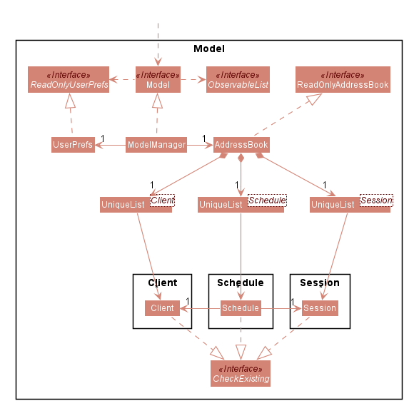
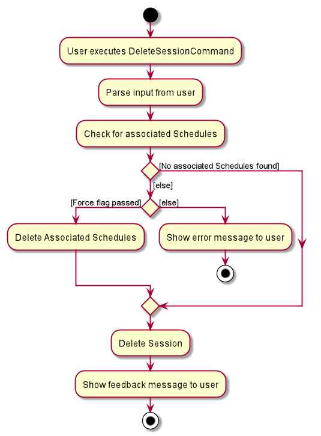
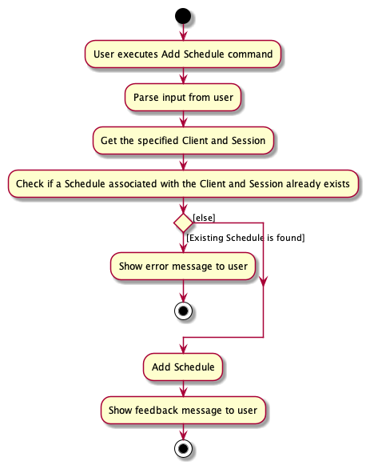
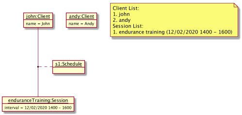
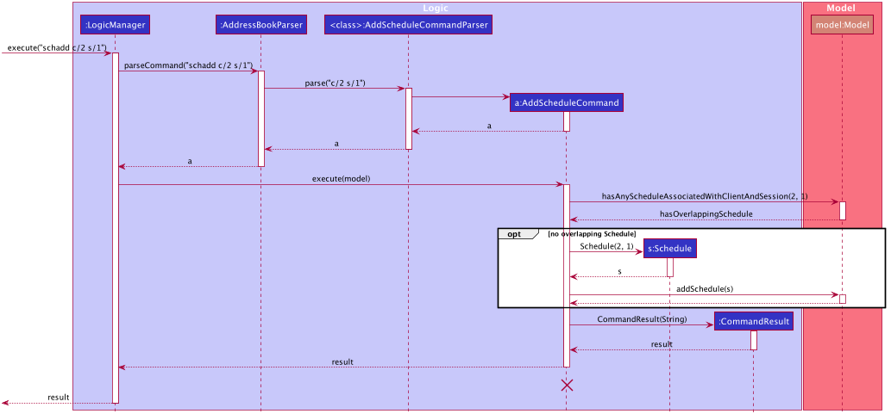
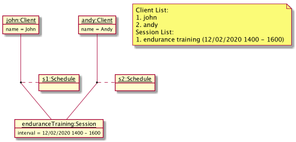
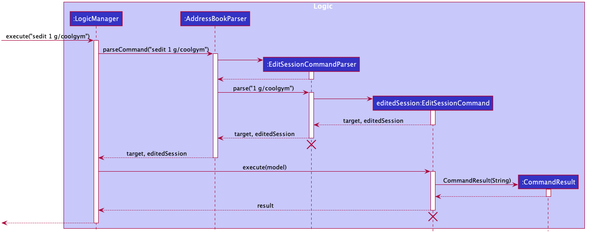
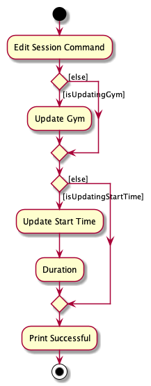
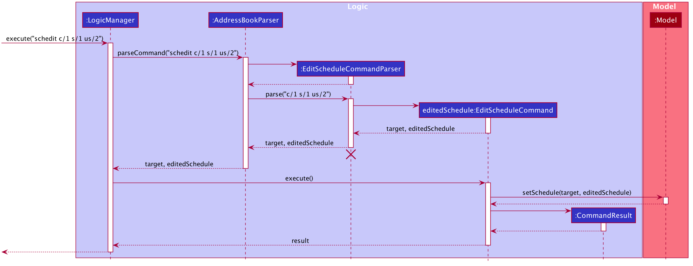
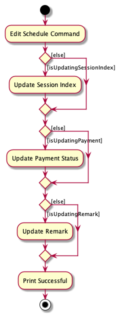

* Table of Contents
{:toc}

--------------------------------------------------------------------------------------------------------------------

## **Setting up, getting started**

Refer to the guide [_Setting up and getting started_](SettingUp.md).

--------------------------------------------------------------------------------------------------------------------

## **Design**

### Architecture


The ***Architecture Diagram*** given above explains the high-level design of the App. Given below is a quick overview of each component.

<div markdown="span" class="alert alert-primary">

:bulb: **Tip:** The `.puml` files used to create diagrams in this document can be found in the [diagrams](https://github.com/AY2021S1-CS2103T-T13-3/tp/tree/master/docs/diagrams/) folder. Refer to the [_PlantUML Tutorial_ at se-edu/guides](https://se-education.org/guides/tutorials/plantUml.html) to learn how to create and edit diagrams.

</div>

**`Main`** has two classes called [`Main`](https://github.com/AY2021S1-CS2103T-T13-3/tp/tree/master/src/main/java/seedu/address/Main.java) and [`MainApp`](https://github.com/AY2021S1-CS2103T-T13-3/tp/tree/master/src/main/java/seedu/address/MainApp.java). It is responsible for,
* At app launch: Initializes the components in the correct sequence, and connects them up with each other.
* At shut down: Shuts down the components and invokes cleanup methods where necessary.

[**`Commons`**](#common-classes) represents a collection of classes used by multiple other components.

The rest of the App consists of four components.

* [**`UI`**](#ui-component): The UI of the App.
* [**`Logic`**](#logic-component): The command executor.
* [**`Model`**](#model-component): Holds the data of the App in memory.
* [**`Storage`**](#storage-component): Reads data from, and writes data to, the hard disk.

Each of the four components,

* defines its *API* in an `interface` with the same name as the Component.
* exposes its functionality using a concrete `{Component Name}Manager` class (which implements the corresponding API `interface` mentioned in the previous point.

For example, the `Logic` component (see the class diagram given below) defines its API in the `Logic.java` interface and exposes its functionality using the `LogicManager.java` class which implements the `Logic` interface.


**How the architecture components interact with each other**

The *Sequence Diagram* below shows how the components interact with each other for the scenario where the user issues the command `cdel 1`.


The sections below give more details of each component.

### UI component


**API** :
[`Ui.java`](https://github.com/AY2021S1-CS2103T-T13-3/tp/tree/master/src/main/java/seedu/address/ui/Ui.java)

The UI consists of a `MainWindow` that is made up of several parts e.g.`CommandBox`, `ResultDisplay`, `ClientListPanel`, `StatusBarFooter`, `Homepage` etc. All these, including the `MainWindow`, inherit from the abstract `UiPart` class.

The `UI` component uses JavaFx and ControlsFX UI framework. The layout of these UI parts are defined in matching `.fxml` files that are in the `src/main/resources/view` folder. For example, the layout of the [`MainWindow`](https://github.com/AY2021S1-CS2103T-T13-3/tp/tree/master/src/main/java/seedu/address/ui/MainWindow.java) is specified in [`MainWindow.fxml`](https://github.com/AY2021S1-CS2103T-T13-3/tp/tree/master/src/main/resources/view/MainWindow.fxml)

The `UI` component interacts with these external API: 

* `Logic` : Performs the Execution of user's commands.
* `Model` : Listens for changes to data so that the UI can be updated with the modified data.

### Logic component


**API** :
[`Logic.java`](https://github.com/AY2021S1-CS2103T-T13-3/tp/tree/master/src/main/java/seedu/address/logic/Logic.java)

1. `Logic` uses the `AddressBookParser` class to parse the user command.
1. This results in a `Command` object which is executed by the `LogicManager`.
1. The command execution can affect the `Model` (e.g. deleting a Client).
1. The result of the command execution is encapsulated as a `CommandResult` object which is passed back to the `Ui`.
1. In addition, the `CommandResult` object can also instruct the `Ui` to perform certain actions, such as displaying help to the user.

Given below is the Sequence Diagram for interactions within the `Logic` component for the `execute("cdel 1")` API call.


<div markdown="span" class="alert alert-info">:information_source: **Note:** The lifeline for `DeleteClientCommandParser` and `DeleteClientCommand` should end at the destroy marker (X) but due to a limitation of PlantUML, the lifeline reaches the end of diagram.
</div>

### Model component



**API** : [`Model.java`](https://github.com/AY2021S1-CS2103T-T13-3/tp/tree/master/src/main/java/seedu/address/model/Model.java)

The `Model`,

* stores a `UserPref` object that represents the user’s preferences.
* stores the address book data.
* exposes an unmodifiable `ObservableList<Client>` that can be 'observed' e.g. the UI can be bound to this list so that the UI automatically updates when the data in the list change.
* does not depend on any of the other three components.


<div markdown="span" class="alert alert-info">:information_source: **Note:** An alternative (arguably, a more OOP) model is given below. It has a `Tag` list in the `AddressBook`, which `Client` references. This allows `AddressBook` to only require one `Tag` object per unique `Tag`, instead of each `Client` needing their own `Tag` object.<br>


</div>


### Storage component


**API** : [`Storage.java`](https://github.com/AY2021S1-CS2103T-T13-3/tp/tree/master/src/main/java/seedu/address/storage/Storage.java)

The `Storage` component,
* can save `UserPref` objects in json format and read it back.
* can save the address book data in json format and read it back.

### Common classes

Classes used by multiple components are in the `seedu.addressbook.commons` package.

--------------------------------------------------------------------------------------------------------------------

## **Implementation**

This section describes some noteworthy details on how certain features are implemented.

### Logging

We are using `java.util.logging` package for logging. The `LogsCenter` class is used to manage the logging levels 
and logging destinations.

- The logging level can be controlled using the `logLevel` setting in the configuration file 
(See [Section 3.2](#configuration), “Configuration”)
- The `Logger` for a class can be obtained using `LogsCenter.getLogger(Class)` which will log messages according 
to the specified logging level
- Currently log messages are output through both `Console` and to a `.log` file.

**Logging Levels**

- **SEVERE** : Critical problem detected which may possibly cause the termination of the application
- **WARNING** : Can continue, but with caution
- **INFO** : Information showing the noteworthy actions by the App
- **FINE** : Details that is not usually noteworthy but may be useful in debugging 
e.g. print the actual list instead of just its size


### Configuration

Certain properties of the application can be controlled(e.g. user prefs file location, logging level), 
through the configuration file (default: `config.json`)


### Delete Session feature

The delete feature allows user to cancel a session, and delete all schedules associated to the session.

#### Implementation

The delete session mechanism is facilitated by `DeleteSessionCommand` which extends `Command`. The format of the 
command is given by: 

```sdel INDEX [f/]```

When using this command, the `INDEX` should refer to the index shown in the SessionList on the right panel.
The user can follow up with an optional force parameters to delete all schedules associated to the session.

**Example Commands**

1. `sdel 1` : This command deletes the first session if no schedules are associated to it
1. `sdel 1 f/` : This command deletes the first session, and all schedules associated to it

The following activity diagram summarizes what happens when a user executes a new `DeleteSession` command



In the following sequence diagram, we trace the execution for when the user decides to enter the DeleteSession command 
`sdel 1 f/` into FitEgo. For simplicity, we will refer to this command input as commandText. We also assume that
there are currently 2 associated schedules to the first session in FitEgo.


 
<div markdown="span" class="alert alert-info">:information_source: **Note:** The lifeline for `DeleteSessionCommand` 
should end at the destroy marker (X) but due to a limitation of PlantUML, the lifeline reaches the end of diagram.

The sequence diagram above shows how the `DeleteSessionCommand` is executed in FitEgo. The LogicManager receives user 
command as commandText and parses it with `AddressBookParser`. It will parse the command and pass the remaining
arguments to `DeleteSessionCommandParser` to construct a `DeleteSessionCommand`. This `DeleteSessionCommand` is 
returned to the `LogicManager` which will then executes it with reference to the model argument.

The model will first get the current `FilteredSessionList` instance to get the session to be deleted. It will then check
whether there exist any `Schedule` associated to the session. If there exists such `Schedule` and the boolean `isForced` 
is set to true, the model will remove them from `AddressBook`. It will then create a `CommandResult` to relay feedback 
message back to the UI and return control back to `LogicManager`

#### Design Considerations

In designing this feature, we had to consider the alternative ways in which we can choose to handle Session deletion

- **Alternative 1 (current choice):** Delete session only after all associated schedules are deleted.
    
    - Pros: 
        1. Easier to maintain data integrity
    - Cons:
        1. Extra logic inside the method implementation 
        2. May have performance issues in terms of response time if there are a lot of Schedules or Sessions
    
- **Alternative 2:** Mark session as deleted and treat schedules with deleted session as invalid
    
    - Pros: 
        1. Easier to implement the method. 
        2. No need to handle additional force flag option
    - Cons: 
        1. We must keep track of deleted sessions, which might make the application bloat up over time.
        2. Harder to maintain data integrity over time
        
- **Alternative 3:** Delete the session without checking for associated schedules

    - Pros: Easy to implement
    - Cons: A schedule might have invalid session, breaking data integrity


### Add Schedule feature

The add schedule feature allows user to create a Schedule associated with a Client and a Session. 
In other words, it allows user to schedule a Client to a Session.

#### Implementation

The add Schedule mechanism is facilitated by `AddScheduleCommand` which extends `Command`. The format of the 
command is given by: 

```schadd c/CLIENT_INDEX s/SESSION_INDEX```
When using this command, the `CLIENT_INDEX` should refer to the index shown in the Client List on the left panel, and is used to specify the Client. The `SESSION_INDEX` should refer to the index shown in the Session List on the right panel, and is used to specify the Session.

The following activity diagram summarizes what happens when a user executes a new `AddSchedule` command. Notice how it checks for overlapping Schedule first.


**Example Commands**

Assume the current state of Client, Session, and Schedule is as illustrated on the following simplified object diagram:



Now, consider two cases of a Schedule Command to be invoked.

**Case 1**:  `schadd c/2 s/1`

Invoking `schadd c/2 s/1` will add a Schedule associated with Andy (the second Client in the Client List) and endurance training from 12/12/2020 1400 - 1600 (the first Session in the Session List). This process can be traced by referring to the following simplified sequence diagram:

  

Thus, the result can be illustrated by the following object diagram, shown by a new created Schedule:



**Case 2:** `schadd c/1 s/1`

On the other hand, invoking `schadd c/1 s/1` will result in an error shown to the user as there is an overlapping Schedule (John is already scheduled to endurance training from 12/12/2020 1400 - 1600).

### \[Proposed\] Undo/redo feature

#### Proposed Implementation

The proposed undo/redo mechanism is facilitated by `VersionedAddressBook`. It extends `AddressBook` with an undo/redo history, stored internally as an `addressBookStateList` and `currentStatePointer`. Additionally, it implements the following operations:

* `VersionedAddressBook#commit()` — Saves the current address book state in its history.
* `VersionedAddressBook#undo()` — Restores the previous address book state from its history.
* `VersionedAddressBook#redo()` — Restores a previously undone address book state from its history.

These operations are exposed in the `Model` interface as `Model#commitAddressBook()`, `Model#undoAddressBook()` and `Model#redoAddressBook()` respectively.

Given below is an example usage scenario and how the undo/redo mechanism behaves at each step.

Step 1. The user launches the application for the first time. The `VersionedAddressBook` will be initialized with the initial address book state, and the `currentStatePointer` pointing to that single address book state.


Step 2. The user executes `cdel 5` command to delete the 5th Client in the address book. The `cdel` command calls `Model#commitAddressBook()`, causing the modified state of the address book after the `cdel 5` command executes to be saved in the `addressBookStateList`, and the `currentStatePointer` is shifted to the newly inserted address book state.


Step 3. The user executes `cadd n/David …​` to add a new Client. The `cadd` command also calls `Model#commitAddressBook()`, causing another modified address book state to be saved into the `addressBookStateList`.


<div markdown="span" class="alert alert-info">:information_source: **Note:** If a command fails its execution, it will not call `Model#commitAddressBook()`, so the address book state will not be saved into the `addressBookStateList`.

</div>

Step 4. The user now decides that adding the Client was a mistake, and decides to undo that action by executing the `undo` command. The `undo` command will call `Model#undoAddressBook()`, which will shift the `currentStatePointer` once to the left, pointing it to the previous address book state, and restores the address book to that state.


<div markdown="span" class="alert alert-info">:information_source: **Note:** If the `currentStatePointer` is at index 0, pointing to the initial AddressBook state, then there are no previous AddressBook states to restore. The `undo` command uses `Model#canUndoAddressBook()` to check if this is the case. If so, it will return an error to the user rather
than attempting to perform the undo.

</div>

The following sequence diagram shows how the undo operation works:


<div markdown="span" class="alert alert-info">:information_source: **Note:** The lifeline for `UndoCommand` should end at the destroy marker (X) but due to a limitation of PlantUML, the lifeline reaches the end of diagram.

</div>

The `redo` command does the opposite — it calls `Model#redoAddressBook()`, which shifts the `currentStatePointer` once to the right, pointing to the previously undone state, and restores the address book to that state.

<div markdown="span" class="alert alert-info">:information_source: **Note:** If the `currentStatePointer` is at index `addressBookStateList.size() - 1`, pointing to the latest address book state, then there are no undone AddressBook states to restore. The `redo` command uses `Model#canRedoAddressBook()` to check if this is the case. If so, it will return an error to the user rather than attempting to perform the redo.

</div>

Step 5. The user then decides to execute the command `clist`. Commands that do not modify the address book, such as `clist`, will usually not call `Model#commitAddressBook()`, `Model#undoAddressBook()` or `Model#redoAddressBook()`. Thus, the `addressBookStateList` remains unchanged.


Step 6. The user executes `clear`, which calls `Model#commitAddressBook()`. Since the `currentStatePointer` is not pointing at the end of the `addressBookStateList`, all address book states after the `currentStatePointer` will be purged. Reason: It no longer makes sense to redo the `cadd n/David …​` command. This is the behavior that most modern desktop applications follow.


The following activity diagram summarizes what happens when a user executes a new command:


#### Design consideration:

##### Aspect: How undo & redo executes

* **Alternative 1 (current choice):** Saves the entire address book.
  * Pros: Easy to implement.
  * Cons: May have performance issues in terms of memory usage.

* **Alternative 2:** Individual command knows how to undo/redo by
  itself.
  * Pros: Will use less memory (e.g. for `cdel`, just save the Client being deleted).
  * Cons: We must ensure that the implementation of each individual command are correct.

_{more aspects and alternatives to be added}_

### Edit Session feature

The proposed edit session mechanism is facilitated by `AddressBook`.

These operation is exposed in the `Model` interface as `Model#setSession()`.

Given below is an example usage scenario and how the edit session mechanism behaves at each step.

Step 1. The user launches the application for the first time.
The `AddressBook` will be initialized with the initial client, session and schedule list.

Step 2. The user executes `sedit 1 g/coolgym` command to edit the 1st Session in the address book. 
The `sedit` command calls `Model#setSession()`, causing changes to be made in the address book after the `sedit 1 g/coolgym` command executes.

The following sequence diagram shows how the edit session operation works:



<div markdown="span" class="alert alert-info">:information_source: **Note:** The lifeline for `EditSessionCommand` should end at the destroy marker (X) but due to a limitation of PlantUML, the lifeline reaches the end of diagram.

</div>

The following activity diagram summarizes what happens when a user executes the edit session command:



### Edit Schedule feature

The proposed edit schedule mechanism is facilitated by `AddressBook`.

These operation is exposed in the `Model` interface as `Model#setSchedule()`.

Given below is an example usage scenario and how the edit schedule mechanism behaves at each step.

Step 1. The user launches the application for the first time.
The `AddressBook` will be initialized with the initial client, session and schedule list.

Step 2. The user executes `schedit c/1 s/1 us/2` command to edit the Schedule with Session 1 and Client 1 in the address book. 
The `schedit` command calls `Model#setSchedule()`, causing changes to be made in the address book after the `schedit c/1 s/1 us/2` command executes.

The following sequence diagram shows how the edit schedule operation works:



<div markdown="span" class="alert alert-info">:information_source: **Note:** The lifeline for `EditScheduleCommand` should end at the destroy marker (X) but due to a limitation of PlantUML, the lifeline reaches the end of diagram.

</div>

The following activity diagram summarizes what happens when a user executes the edit schedule command:



#### Design consideration:

##### Aspect: How edit schedule executes

* **Alternative 1 (current choice):** Retrieve Schedule using Client and Session Index.
  * Pros: More troublesome to implement. Clearer to retrieve.
  * Cons: Require user to know the Client and Session Index separately.

* **Alternative 2:** Retrieve Schedule using Schedule Index
  itself.
  * Pros: Easier to retrieve.
  * Cons: Implementation is more confusing as User there's a conflict between Index and user-typed String index.

### \[Proposed\] Data archiving

_{Explain here how the data archiving feature will be implemented}_


--------------------------------------------------------------------------------------------------------------------

## **Documentation, logging, testing, configuration, dev-ops**

* [Documentation guide](Documentation.md)
* [Testing guide](Testing.md)
* [Logging guide](Logging.md)
* [Configuration guide](Configuration.md)
* [DevOps guide](DevOps.md)

--------------------------------------------------------------------------------------------------------------------

## **Appendix: Requirements**

### Product scope

**Target user profile**:
* is a fitness instructor who have trouble managing a significant number of clients and sessions
* prefer desktop apps over other types
* favours a All-in-One software tracker
* can type fast
* prefers typing to mouse interactions
* is reasonably comfortable using CLI apps while appreciates a nice GUI that can show his weekly schedule
* prefers a simple and minimalistic view, as he does not like clutters.

**Value proposition**: to help a fitness instructor keeps track of his customers easily, via CLI as he’s a fast typer.
He can spend more time on his clients/his routine rather than manually using alternative software like Excel to track
administrative matters.


### User stories

Priorities: High (must have) - `* * *`, Medium (nice to have) - `* *`, Low (unlikely to have) - `*`

| Priority | As a ...                                     | I want to ...                    | So that I can ...                                                         |
| -------- | ------------------------------------------ | ------------------------------ | ---------------------------------------------------------------------- |
| `* * *`  | new trainer                                   | see usage instructions         | refer to instructions when I forget how to use the App                 |
| `* * *`  | trainer                                       | add a new client               |                                                                        |
| `* * *`  | trainer                                       | edit a client                  | change the details of a client                                         |
| `* * *`  | trainer                                       | view a Client's detail         | view at all of the client's details at a glance                        |
| `* * *`  | trainer                                       | delete a client                | remove entries that I no longer need                                   |
| `* * *`  | trainer                                       | find a client by name          | locate details of clients without having to go through the entire list |
| `* * *`  | trainer                                       | tag my client         | I know their allergy / injury history and can advise them an appropriate training / diet schedule |
| `* * *`  | trainer                                       | create a Session               |                                                                        |
| `* * *`  | trainer                                       | edit a session                 | change the details of a session                                        |
| `* * *`  | trainer                                       | view a session's detail        | view at all of the session's details at a glance                       |
| `* * *`  | busy fitness trainer                          | filter sessions by time        | view only the upcoming or other important sessions                             |
| `* * *`  | trainer                                       | delete a Session               | cancel all schedules if there is an urgent need                        |
| `* * *`  | trainer                                       | add a new schedule             |                                                                        |
| `* * *`  | trainer                                       | edit a schedule                | change the details of a schedule                                       |
| `* * *`  | trainer                                       | view a schedule's detail       | view at all of the schedule's details at a glance                      |
| `* * *`  | trainer                                       | delete a schedule              | remove schedule that are cancelled or completed                        |
| `* *`    | trainer                                       | hide private contact details   | minimize chance of someone else seeing them by accident                |
| `* *`    | forgetful fitness trainer                     | track clients' payments        | remind those who have not paid up                                      |
| `* *`    | busy fitness trainer                          | query if a particular time slot is open     | add new clients to that time slot                         |
| `* *`    | fitness trainer                               | track clients' weight over time| keep track of my clients progress over time                            |
| `* *`    | fitness trainer                               | store clients' session feedback| utilise previous sessions and plan exercises for upcoming sessions     |
| `*`      | trainer with many clients in the address book | sort clients by name           | locate a client easily                                                 |
| `*`      | user                                          | change software background between light and dark mode | customise my experience                        |
| `*`      | trainer focused on coaching pre-NS teen       | track client's date of birth   | adjust the fitness intensity depending on IPPT period                  |


*{More to be added}*

### Use cases

(For all use cases below, the **System** is the `FitEgo` and the **Actor** is the `user`, unless specified otherwise)


**Use case: Add a Client**

**MSS**

1.  User requests to add a specific Client in the list
2.  FitEgo adds the Client

    Use case ends.

**Use case: Edit a Client**

**MSS**

1.  User requests to list Clients
2.  FitEgo shows a list of Clients
3.  User requests to edit a specific Client in the list
4.  FitEgo edits the Client according to the specified details

    Use case ends.

**Extensions**

* 2a. The list is empty.

  Use case ends.

* 3a. The given index is invalid.

    * 3a1. FitEgo shows an error message.

      Use case resumes at step 2.

**Use case: Delete a Client**

**MSS**

1.  User requests to list Clients
2.  FitEgo shows a list of Clients
3.  User requests to delete a specific Client in the list
4.  FitEgo deletes the Client

    Use case ends.

**Extensions**

* 2a. The list is empty.

  Use case ends.
  
* 2b. User requests to force delete a specific Client in the Client List.

    * 2b1. FitEgo force deletes the Client and its associated Schedules.
  
    Use case ends.

* 3a. The given index is invalid.

    * 3a1. FitEgo shows an error message.

      Use case resumes at step 2.

* 3b. The given index refers to a client associated with one or more Schedule.
    
    * 3b1. FitEgo shows an error message.
    
      Use case resumes at step 2.
      
      

**Use case: Tag a Client**

**MSS**

1.  User requests to list Clients
2.  FitEgo shows a list of Clients
3.  User requests to tag a specific Client from the list
4.  FitEgo changes the Client's current tag(s) according to the specified details
    Use case ends.

**Extensions**

* 2a. No tag is defined.

  Use case ends.

* 3a. The given tag is invalid.

    * 3a1. FitEgo shows an error message.

      Use case resumes at step 2.

**Use case: Find Clients**

**MSS**

1.  User requests to find some Client based on keyword or text.
2.  FitEgo displays the client's whose name matches the keyword or text.

    Use case ends.

**Extensions**

* 2a. The search result is empty.
    2a1. FitEgo displays no clients found.

  Use case ends.

**Use case: View a Client**

**MSS**

1.  User requests to list Clients.
2.  FitEgo shows a list of Clients.
3.  User requests to view a specific Client in the list
4.  FitEgo opens the client's profile in a new window.

    Use case ends.

**Extensions**
* 2a. The list is empty.

  Use case ends.

* 3a. The given index is invalid.

    * 3a1. FitEgo shows an error message.

      Use case resumes at step 3.

* 4a. Previous Client's profile window is not closed.
    * 4a1. The previous client's profile will be closed.
    * 4a2. The current client's profile will be displayed.

      Use case ends
      
      
**Use case: Create a Session**

**MSS**
1.  User requests to add a specific Session in the list
2.  FitEgo adds the Session.

    Use case ends.
    
**Extensions**

* 1a. The session overlaps with an existing Session.
    
    * 1a1. FitEgo shows an error message.

      Use case ends.
      
* 1b. The Session is missing some required details.

    * 1b1. FitEgo shows an error message.
    
       Use case ends.
      
      
**Use case: Edit a Session**

**MSS**

1.  FitEgo shows a list of Sessions
2.  User requests to edit a specific Session in the list (i.e. gym, exercise type, start time and duration)
3.  FitEgo edits the Session according to the specified details

    Use case ends.

**Extensions**

* 1a. The list is empty.

  Use case ends.

* 2a. The given index is invalid or request to edit is absent.

    * 2a1. FitEgo shows an error message.

      Use case resumes at step 2.
      
      
**Use case: Deleting a Session**

**MSS**

1.  User requests to list Sessions
2.  FitEgo shows a list of Sessions
3.  User requests to delete a specific Session in the list
4.  FitEgo deletes the Session

    Use case ends.

**Extensions**

* 2a. The list is empty.

  Use case ends.

* 3a. The given index is invalid.

    * 3a1. FitEgo shows an error message.

      Use case resumes at step 2.

*  3b. The Session has schedules associated to it.
    
    * 3b1. FitEgo shows a help message.
    
       Use case resumes at step 2.     
      

**Use case: View Session within time period**

**MSS**

1.  FitEgo shows a list of Sessions
2.  User requests to filter the Session List by a period
3.  FitEgo filters the Session List according to the specified period and updates its title.

    Use case ends.

**Extensions**

* 1a. The list is empty.

  Use case ends.

* 2a. The given period is invalid.

    * 2a1. FitEgo shows an error message.

      Use case resumes at step 2.     

**Use case: Add a Schedule**

**MSS**

1. FitEgo shows a list of Clients and list of Sessions

2. User requests to add a specific Schedule between a specified Client from Client List and Session from Session List

3. FitEgo adds the Schedule

   Use case ends.

**Extensions**

- 2a. The Client index or Session index is invalid

  - 2a1. FitEgo shows an error message

    Use case resumes at step 2.
  
- 2b. The Schedule to be added is overlapping with another Schedule

  - 2b1. FitEgo shows an error message

    Use case resumes at step 2.
    
**Use case: Edit a Schedule**

**MSS**

1.  FitEgo shows a list of Schedule
2.  User requests to edit a specific Schedule in the list (i.e. updated session index, update payment, update weight)
3.  FitEgo edits the Schedule according to the specified details

    Use case ends.

**Extensions**

* 1a. The list is empty.

  Use case ends.

* 2a. The given index is invalid or request to schedule is absent.

    * 2a1. FitEgo shows an error message.

      Use case resumes at step 2.

**Use case: Delete a Schedule**

**MSS**

1. FitEgo shows a list of Clients and list of Sessions

2. User requests to delete a Schedule asssociated with a specified Client from the Client List and Session from the Session List

3. FitEgo deletes the Schedule

   Use case ends.

**Extensions**

- 2a. The Client index or Session index is invalid

  - 2a1. FitEgo shows an error message

    Use case resumes at step 2.

- 2b. No Schedule is associated with the specified Client and Session

  - 2b1. FitEgo shows an error message

    Use case resumes at step 2.

**Use case: Open User Guide in Browser**

**MSS**
1.  User requests to view Help window. 
2.  FitEgo displays help window with the User Guide link.
3.  User selects the link to access the User Guide. 
4.  FitEgo opens the User Guide. 

    Use case ends.

**Extensions**
* 3a. User closes the help window. 
    * 3a1. FitEgo closes the help window
	
      Use case ends.


### Non-Functional Requirements

1.  Should work on any _mainstream OS_ as long as it has Java `11` or above installed.
2.  Should be able to hold up to 1000 clients and sessions without a noticeable sluggishness in performance for typical usage.
3.  A fitness instructor with above average typing speed for regular English text (i.e. not code, not system admin commands) should be able to accomplish most of the tasks faster using commands than using the mouse.
4.  The source code should be open source.
5.  The application should be usable without internet connection
6.  The user interface should be intuitive enough for users who are not IT-savvy
7.  The product can be downloaded freely from Github.
8.  The user should be able to read the data files.
9.  The user should be able to modify the data files.
10.  The user should be able to use the application on different machines just by moving the data file
from your previous machine to your new machine.


### Glossary

* **API**: Application Programming Interface
* **Mainstream OS**: Windows, Linux, Unix, OS-X

--------------------------------------------------------------------------------------------------------------------

## **Appendix: Instructions for manual testing**

Given below are instructions to test the app manually.

<div markdown="span" class="alert alert-info"> 
:information_source: **Note:** These instructions only provide a starting point for testers to work on;
testers are expected to do more *exploratory* testing.
</div>

### Launch and shutdown

1. Initial launch

   1. Download the jar file and copy into an empty folder

   1. Double-click the jar file Expected: Shows the GUI with a set of sample contacts. The window size may not be optimum.

1. Saving window preferences

   1. Resize the window to an optimum size. Move the window to a different location. Close the window.

   1. Re-launch the app by double-clicking the jar file.<br>
      Expected: The most recent window size and location is retained.

1. _{ more test cases …​ }_

### Adding a Client

1. Adding a Client while all Clients are being shown

   1. Test case: `cadd n/David …​` <br>
      Expected: First contact is added to the list. Details of the added contact shown in the status message.

### Deleting a Client

1. Deleting a Client while all Clients are being shown

   1. Prerequisites: List all Clients using the `clist` command. Multiple Clients in the list.

   1. Test case: `cdel 1`<br>
      Expected: First contact is deleted from the list. Details of the deleted contact shown in the status message.

   1. Test case: `cdel 0`<br>
      Expected: No Client is deleted. Error details shown in the status message. Status bar remains the same.

   1. Other incorrect client delete commands to try: `cdel`, `cdel x`, `...` (where x is larger than the list size)<br>
      Expected: Similar to previous.

### Adding a Session

1. Adding a Session while all Clients are being shown.

    1. Test case: `sadd g/Machoman Gym ex/Endurance at/29/09/2020 1600 t/120` <br>
       Expected: Session is added to the list, and it is shown in order. Details of the added session shown in the
       status message.
    
    1. Test case: `sadd g/machoman` <br>
       Expected: No Session is added. Error details shown in the status message.
       
    1. Other incorrect AddSession commands to try: 
        `sadd g/machoman ex/endurance at/29/09/2020 t/120` (wrong date format),
        `sadd g/machoman ex/endurance at/29/09/2020 1600 t/0` (invalid duration) <br>
       Expected: Similar to previous.

### Editing a Session

1. Editing a Session while all Sessions are being shown

   1. Prerequisites: Multiple Sessions in the list can be viewed on the right panel of the GUI.
    
   1. Test case: `sedit 1 g/Machoman`<br>
      Expected: First Session's gym location is edited.
      Details of the edited session is shown in the status message.

   1. Test case: `sedit 1 at/29/09/2020 1600 t/120`<br>
      Expected: First Session timing is edited.
      Details of the edited session is shown in the status message.

   1. Other incorrect edit commands to try: `sedit`, `sedit x`, `...` (where x is larger than the list size)<br>
      Expected: Similar to previous.
      
### Deleting a Session

   1. Test case: `sdel 1 f/` <br>
       Expected: The session in index 1 (as shown in the Session List) will be deleted alongside all schedules associated
       to the session. Details of the deleted session is shown in the status message.
    
   1. Test case: `sdel 1` <br>
       Expected: If there are no schedules associated to the session in index 1 (as shown in the Session List), similar to
       previous. Else, it will not delete the session and error message will be shown in the status message
       
   1. Other incorrect DeleteSession commands to try: `sdel`, `sdel x` (where x is larger than the list size)<br>
       Expected: It will not delete the session and error message will be shown in the status message.


### Viewing Sessions within Period

1. Viewing Sessions within Period while the Session List is non-empty

   1. Prerequisites: Multiple Sessions in the list can be viewed on the right panel of the GUI.

   1. Test case: `sview p/+1d`<br>
      Expected: The right panel only displays Sessions with start time from 0000hrs today to 2359hrs the next day.
      Indication that Session List has been successfully updated is shown in the status message.

   1. Test case: `sview p/past`<br>
      Expected: The right panel only displays Sessions that have already ended before time of execution.
      Indication that Session List has been successfully updated is shown in the status message.

   1. Other incorrect edit commands to try: `sview`, `sview p/+2s` (where unit of time is not d/m/y), `...` <br>
      Expected: Similar to previous.
      
### Adding a Schedule

1. Adding a Schedule while all Clients and Sessions are being shown

   1. Prerequisites: Multiple Clients and Sessions in the list can be viewed on the left and right panel of the GUI respectively.
   1. Test case: `schadd c/1 s/1`<br>
      Expected: Add a Schedule associated with Client of index 1 in the Client List and Session of index 1 in the Session List.
      Details of the added Schedule is shown in the status message.
   1. Test case: `schadd s/1 c/2`<br>
      Expected: Add a Schedule associated with Client of index 2 in the Client List and Session of index 1 in the Session List.
      Details of the added Schedule is shown in the status message.
   1. Other incorrect Add Schedule commands to try: `schadd c/1`, `schadd c/0 s/2`, `schadd c/x s/y`, `...` (where x is larger than the Client List size or y is larger than the Session List size)<br>
      Expected: No Schedule is added. Error details shown in the status message.

### Editing a Schedule

1. Editing a Schedule while all Schedules are being shown

   1. Prerequisites: Multiple Schedules in the list can be viewed on the main panel of the GUI.

   1. Test case: `schedit c/1 s/1 us/2`<br>
      Expected: Edit Schedule with client index 1 and session index 1 is edited to session index 2.
      Details of the edited schedule is shown in the status message.

   1. Test case: `schedit c/2 s/1 us/2`<br>
      Expected: Edit Schedule with client index 2 and session index 1 is edited to session index 2.
      Details of the edited schedule is shown in the status message.
      
   1. Test case: `schedit c/1 s/1 pd/paid`<br>

     Expected: Edit Schedule with client index 1 and session index 1 payment update to be paid. 
     In the right panel, the client's name in the related session will be indicated as green. 
     Details of the edited schedule is shown in the status message.
         
   1. Test case: `schedit c/1 s/1 pd/unpaid`<br>
    Expected: Edit Schedule with client index 1 and session index 1 payment update to be unpaid. 
    In the right panel, the client's name in the related session will be indicated as red. 
    Details of the edited schedule is shown in the status message.
    
   1. Test case: `schedit c/1 s/1 r/text`<br>
       Expected: Edit Schedule with client index 1 and session index 1 remark to "text". 
       In the right panel, the client's name in the related session will be indicated as red. 
       Details of the edited schedule is shown in the status message.

   1. Other incorrect edit commands to try: `schedit c/1`, `schedit c/1 s/2`, `schedit c/x s/y us/y`, `...` (where x is larger than the client list size or y is larger than the session list size)<br>
      Expected: Similar to previous.

### Deleting a Schedule

1. Deleting a Schedule while all Clients and Sessions are being shown

   1. Prerequisites: Multiple Clients and Sessions in the list can be viewed on the left and right panel of the GUI respectively.
   1. Test case: `schdel c/1 s/1`<br>
      Expected: Delete the Schedule associated with Client of index 1 in the Client List and Session of index 1 in the Session List.
      Details of the deleted Schedule is shown in the status message.
   1. Test case: `schdel s/1 c/2`<br>
      Expected: Delete the Schedule associated with Client of index 2 in the Client List and Session of index 1 in the Session List.
      Details of the added Schedule is shown in the status message.
   1. Other incorrect Delete Schedule commands to try: `schdel c/1`, `schdel c/0 s/2`, `schdel c/x s/y`, `...` (where x is larger than the Client List size or y is larger than the Session List size)<br>
      Expected: No Schedule is deleted. Error details shown in the status message.

### Saving data

1. Dealing with missing/corrupted data files

   1. _{explain how to simulate a missing/corrupted file, and the expected behavior}_

1. _{ more test cases …​ }_
