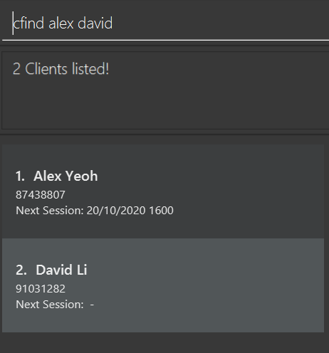

FitEgo is a **desktop app for fitness instructors to manage their clients and schedules, optimized for use via a Command Line Interface** (CLI) while still having the benefits of a Graphical User Interface (GUI). If you can type fast, FitEgo can get your client management tasks done faster than traditional GUI apps.

* Table of Contents
{:toc}

--------------------------------------------------------------------------------------------------------------------

## Quick start

1. Ensure you have Java `11` or above installed in your Computer.

1. Download the latest `fitego.jar` from [here](https://github.com/AY2021S1-CS2103T-T13-3/releases).

1. Copy the file to the folder you want to use as the _home folder_ for your AddressBook.

1. Double-click the file to start the app. The GUI similar to the below should appear in a few seconds. Note how the app contains some sample data. 
   

1. Type the command in the command box and press Enter to execute it. e.g. typing **`help`** and pressing Enter will open the help window. 
   Some example commands you can try:

   * **`clist`** : Lists all clients.

   * **`cadd`**`cadd n/Jane Doe p/91234567 e/jane@gmail.com` : Adds a client named `Jane Doe` to the clients list.

   * **`cdel`**`3` : Deletes the 3rd client shown in the current list.

   * **`exit`** : Exits the app.

1. Refer to the [Features](#features) below for details of each command.

--------------------------------------------------------------------------------------------------------------------

## Features

**:information_source: Notes about the command format:** 

* Words in `UPPER_CASE` are the parameters to be supplied by the user. 
  e.g. in `add n/NAME`, `NAME` is a parameter which can be used as `add n/John Doe`.

* Items in square brackets are optional. 
  e.g `n/NAME [t/TAG]` can be used as `n/John Doe t/friend` or as `n/John Doe`.

* Items with `…`​ after them can be used multiple times including zero times. 
  e.g. `[t/TAG]…​` can be used as ` ` (i.e. 0 times), `t/friend`, `t/friend t/family` etc.

* Parameters can be in any order. 
  e.g. if the command specifies `n/NAME p/PHONE_NUMBER`, `p/PHONE_NUMBER n/NAME` is also acceptable.

### Viewing help : `help`

Shows a message explaning how to access the help page.

Format: `help`

### Adding a client: `cadd`

Adds a client to the clients list.

Format: `cadd n/NAME p/PHONE_NUMBER e/EMAIL [t/TAG]`

:bulb: **Tip:**
A person can have any number of tags (including 0)

Examples:
* `cadd n/Jane Doe p/91234567 e/jane@gmail.com`
* `cadd n/John Doe p/91231367 e/jojo@gmail.com t/vegetarian`

### Listing all clients : `clist`

Shows a list of all clients in the clients list.

Format: `clist`

### Editing a person : `cedit`

Edits an existing person in the clients list.

Format: `cedit INDEX [n/NAME] [p/PHONE] [e/EMAIL] [a/ADDRESS] [t/TAG]`

* Edits the person at the specified `INDEX`. The index refers to the index number shown in the displayed person list. The index **must be a positive integer** 1, 2, 3, …​
* At least one of the optional fields must be provided.
* Existing values will be updated to the input values.
* When editing tags, the existing tags of the person will be removed i.e adding of tags is not cumulative.
* You can remove all the person’s tags by typing `t/` without
    specifying any tags after it.

Examples:
*  `cedit 1 n/Janie Doe` Edits the name of the 1st person to be `Janie Doe`.

### Locating clients by name: `cfind`

Finds clients whose names contain any of the given keywords.

Format: `cfind KEYWORD [MORE_KEYWORDS]`

* The search is case-insensitive. e.g `hans` will match `Hans`
* The order of the keywords does not matter. e.g. `Hans Bo` will match `Bo Hans`
* Only the name is searched.
* Only full words will be matched e.g. `Han` will not match `Hans`
* Persons matching at least one keyword will be returned (i.e. `OR` search).
  e.g. `Hans Bo` will return `Hans Gruber`, `Bo Yang`

Examples:
* `find John` returns `john` and `John Doe`
* `find alex david` returns `Alex Yeoh`, `David Li` 
  

### Deleting a person : `cdel`

Deletes the specified client from the clients list.

Format: `cdel INDEX`

* Deletes the person at the specified `INDEX`.
* The index refers to the index number shown in the displayed person list.
* The index **must be a positive integer** 1, 2, 3, …​

Examples:
* `list` followed by `cdel 2` deletes the 2nd person in the address book.
* `find Betsy` followed by `cdel 1` deletes the 1st person in the results of the `find` command.

### Exiting the program : `exit`

Exits the program.

Format: `exit`

### Saving the data

AddressBook data are saved in the hard disk automatically after any command that changes the data. There is no need to save manually.

### Adding and deleting gym sessions `[coming in v1.2]`

_Allow the creation of sessions and tagging of its associated client_

--------------------------------------------------------------------------------------------------------------------

## FAQ

**Q**: How do I transfer my data to another Computer? 
**A**: Install the app in the other computer and overwrite the empty data file it creates with the file that contains the data of your previous AddressBook home folder.

--------------------------------------------------------------------------------------------------------------------

## Command Summary 
| Action | Format | Example | 
| -------| -------| --------| 
|Adding Clients  Info| `cadd n/NAME p/PHONE_NUMBER e/EMAIL [t/TAG]`| `cadd n/Jane Doe p/91234567 e/jane@gmail.com`|
|Update Clients Info | `cedit INDEX [n/NAME] [p/PHONE] [e/EMAIL] [a/ADDRESS] [t/TAG]`| `cedit 1 n/Janie Doe`|
|Deleting Client Info |`cdel INDEX` |`cdel 1`|
|List All Clients | `clist`  |  `clist`  |
|Find Client by Name | `cfind KEYWORD [MORE_KEYWORDS]`| `cfind John Doe`|
|Adding Gym Session |`sadd s/SESSIONTYPE dt/DATETIME dur/DURATION g/GYM_NAME` | `sadd Upper Body dt/this Thursday 4pm dur/2hr g/UTown Gym`|
|Assign a Client to Gym Session  |`sched add c/CLIENT_INDEX s/SESSION_INDEX`| `sched add c/1 s/3`|
|Unassign a Client to Gym Session |`sched rm c/CLIENT_INDEX s/SESSION_INDEX`  | `sched rm c/2 s/3` |
|Updating Session Info |`sedit INDEX [s/SESSIONTYPE] [dt/DATETIME] [dur/DURATION] [g/GYM_NAME]`| `sedit 1 dt/this Friday 6pm`|
|Deleting a Session |`sdel INDEX` | `sdel 1`|
